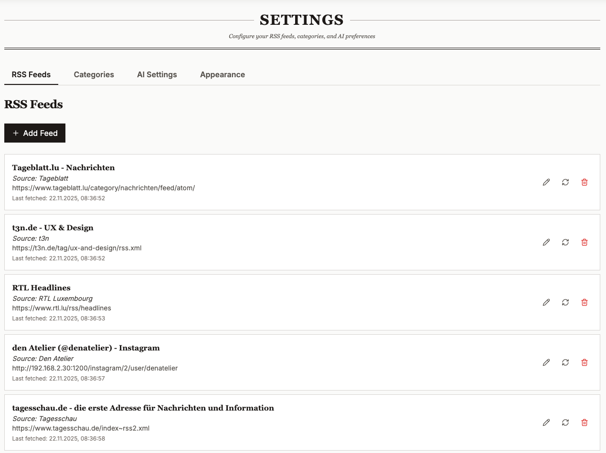

# Curio - Your AI-Powered Personal Newspaper

<div align="center">


**Transform your RSS feeds into a beautifully curated daily newspaper**

[](https://www.docker.com/)
[](https://unraid.net/)
[](LICENSE)

</div>

## What is Curio?

Curio is a self-hosted news aggregator that brings back the joy of reading a morning newspaper. It collects articles from your favorite RSS feeds, uses AI to curate and summarize them based on your interests, and presents everything in a beautiful newspaper-style layout.

**Perfect for:** News enthusiasts, researchers, professionals who want to stay informed, or anyone tired of endless scrolling through cluttered news apps.

## ✨ Features

### 📰 Daily Newspaper Experience

- **Newspaper-style layout** with hero articles, featured stories, and regular news
- **Daily editions** - Fresh curated content every day
- **Grid or list view** - Switch between layouts based on your preference
- **Responsive design** - Looks great on desktop, tablet, and mobile

### 🤖 AI-Powered Curation

- **Smart article selection** - AI picks the most relevant articles for you
- **Enhanced titles & summaries** - AI-generated titles and concise summaries
- **Relevance scoring** - Articles ranked by importance to your interests
- **Duplicate detection** - No more seeing the same story from multiple sources

### 📂 Organization & Reading

- **Categories** - Organize feeds into topics (Tech, Science, Business, etc.)
- **Saved articles** - Bookmark articles to read later
- **Unread indicators** - Track what you haven't read yet
- **Auto mark-as-read** - Articles marked read as you scroll through them

### ⚙️ Customization

- **Custom newspaper title** - Personalize your daily edition
- **Interest configuration** - Tell the AI what topics matter to you
- **Multiple RSS feeds** - Add unlimited feeds from any source
- **Flexible scheduling** - Control how often feeds are fetched

## Screenshots

<div align="center">

### Today's Edition


### Reading Articles



### Settings


</div>

## 🚀 Installation

### Prerequisites

- **Docker** - For running the application
- **OpenAI API Key** - For AI features ([Get one here](https://platform.openai.com/api-keys))
- **PostgreSQL** - Database (included in Docker setup)

### Option 1: Unraid (Recommended for Home Servers)

1. **Install from Docker Hub:**

   - Go to the **Docker** tab in Unraid
   - Click **Add Container**
   - Set **Repository** to: `ghcr.io/cyberdns/curio:1`

2. **Configure the container:**

   - **Network Type:** `bridge`
   - **Port:** `8080` → `8080` (WebUI)

3. **Add required environment variables:**
   | Variable | Value |
   |----------|-------|
   | `OPENAI_API_KEY` | Your OpenAI API key |
   | `SECRET_KEY` | Random string for security (min 32 chars) |
   | `POSTGRES_PASSWORD` | Choose a secure password |
   | `DEV_MODE` | `true` (for single-user setup) |

4. **Add volume mappings:**

   - `/mnt/user/appdata/curio/data` → `/data` (Database storage)

5. **Apply and start** the container

6. **Access Curio** at `http://your-server-ip:8080`

### Option 2: Docker Compose

1. **Create a directory and docker-compose.yml:**

   ```bash
   mkdir curio && cd curio
   ```

   ```yaml
   version: "3.8"

   services:
     curio:
       image: ghcr.io/cyberdns/curio:latest
       ports:
         - "8080:8080"
       environment:
         - OPENAI_API_KEY=sk-your-api-key
         - SECRET_KEY=your-secret-key-min-32-characters
         - POSTGRES_PASSWORD=secure-password
         - DEV_MODE=true
       volumes:
         - curio-data:/data
       restart: unless-stopped

   volumes:
     curio-data:
   ```

2. **Start the application:**

   ```bash
   docker-compose up -d
   ```

3. **Access Curio** at `http://localhost:8080`

### Option 3: Separate Containers (Advanced)

For more control, you can run backend and frontend separately. See [DOCKER.md](DOCKER.md) for detailed instructions.

## 📖 Getting Started

### 1. Configure Your Interests

Go to **Settings → AI Settings** and describe what topics interest you:

```
I'm interested in:
- Technology and software development
- AI and machine learning breakthroughs
- Science discoveries and space exploration
- Business and startup news

I prefer:
- In-depth technical articles
- Breaking news about major developments
- Research papers and analysis

Please avoid:
- Celebrity news
- Sports
- Opinion pieces
```

### 2. Add RSS Feeds

Go to **Settings → RSS Feeds** and add your favorite news sources:

- Paste any RSS feed URL
- Assign it to a category
- Curio will start fetching articles

**Popular feeds to get started:**

- Hacker News: `https://news.ycombinator.com/rss`
- TechCrunch: `https://techcrunch.com/feed/`
- Ars Technica: `https://feeds.arstechnica.com/arstechnica/index`
- The Verge: `https://www.theverge.com/rss/index.xml`

### 3. Create Categories

Go to **Settings → Categories** to organize your feeds:

- Create categories like "Technology", "Science", "Business"
- Assign feeds to categories
- Browse articles by category in the navigation

### 4. Generate Your First Edition

- Click **Refresh** in the header to fetch articles
- Go to **Settings → AI Settings** and click **Process New Articles**
- Return to the home page to see your personalized newspaper!

## ⚙️ Configuration

### Environment Variables

| Variable             | Required | Default               | Description                                 |
| -------------------- | -------- | --------------------- | ------------------------------------------- |
| `OPENAI_API_KEY`     | Yes      | -                     | Your OpenAI API key                         |
| `SECRET_KEY`         | Yes      | -                     | Random string for JWT tokens (min 32 chars) |
| `POSTGRES_PASSWORD`  | Yes      | -                     | Database password                           |
| `DEV_MODE`           | No       | `false`               | Set to `true` for single-user mode          |
| `LLM_MODEL`          | No       | `gpt-4-turbo-preview` | OpenAI model to use                         |
| `RSS_FETCH_INTERVAL` | No       | `60`                  | Minutes between automatic feed updates      |

### Customizing Your Newspaper

Go to **Settings → Appearance** to:

- Set a custom newspaper title
- Preview how your header will look

## ❓ Troubleshooting

### Articles not appearing?

1. Make sure you've added RSS feeds in Settings
2. Click **Refresh** in the header to fetch new articles
3. Go to **AI Settings** and click **Process New Articles**

### AI features not working?

1. Verify your `OPENAI_API_KEY` is set correctly
2. Check you have available credits at [OpenAI Usage](https://platform.openai.com/usage)
3. Make sure you've configured your interests in AI Settings

### Container won't start?

1. Ensure all required environment variables are set
2. Check that port 8080 isn't in use by another application
3. Verify volume permissions for database storage

## 💰 Cost Considerations

Curio uses OpenAI's API for AI features. Typical costs:

- **Initial setup:** ~$0.10-0.50 to process your first batch of articles
- **Daily usage:** ~$0.05-0.20 depending on article volume
- **Tip:** Use `gpt-4o-mini` model for lower costs (set `LLM_MODEL=gpt-4o-mini`)

Monitor your usage at [OpenAI Platform](https://platform.openai.com/usage).

## 🤝 Contributing

Contributions are welcome! See [CONTRIBUTING.md](CONTRIBUTING.md) for development setup and guidelines.

## 📄 License

MIT License - see [LICENSE](LICENSE) for details.

## 🙏 Acknowledgments

- Inspired by the timeless design of classic newspapers
- AI curation powered by OpenAI

---

<div align="center">

**Made with ☕ for news lovers everywhere**

[Report Bug](https://github.com/CyberDNS/curio/issues) · [Request Feature](https://github.com/CyberDNS/curio/issues)

</div>
